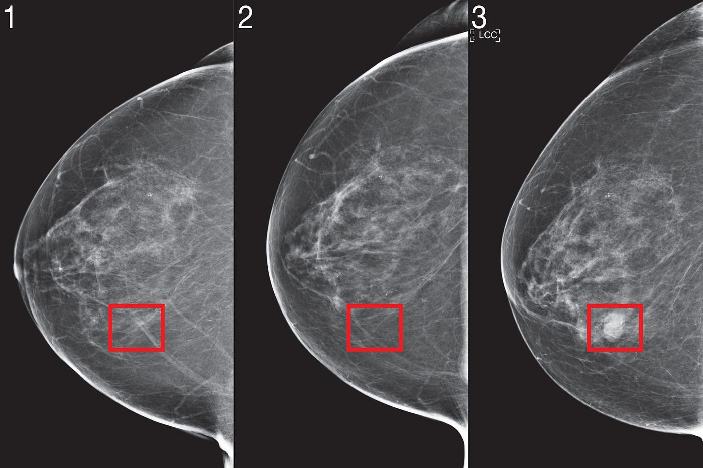

# Autovectores-y-Autovalores-en-Ciencia-de-Datos
Una pequeña introducción a la cuestión de la aplicación de Autovectores y Autovalores en álgebra lineal y también sobre todo en Ciencia de Datos.

Acá hay dos archivos principales:
1. Unas notas de clase muy breves de introduccion a la sesión de Autovectores y Autovalores en Ciencia de Datos y Matematicas. Son muy breves e introductorias, el ánimo de ellas es crear curiosidad y motivar una lectura más profunda.

2. Un notebook de python para un ejercicio sencillo de aplicación de cómo trabajan los autovalores y autovectores en Ciencia de datos particularmente en el desarrollo de algoritmos de _Principal Component Analysis_. El caso de uso es oara predecir tipos de Orquideas en un trabajo de investigacion. https://archive.ics.uci.edu/dataset/53/iris
 
  
3. Otro notebook de python para un ejercicio sencillo de aplicación de cómo trabajan los autovalores y autovectores en Ciencia de datos particularmente en el desarrollo de algoritmos de _Principal Component Analysis_. En este caso el caso de aplicaciones es la prediccion de imágenes diagnósticas de cancer mamario. El cáncer de mama es una enfermedad en la que células anormales de la mama crecen sin control, pudiendo formar tumores que se extienden. Es el cáncer más frecuente en las mujeres, aunque también puede afectar a los hombres, y su detección precoz mediante cribado y autoexámenes es crucial para el éxito del tratamiento. https://archive.ics.uci.edu/dataset/14/breast+cancer

